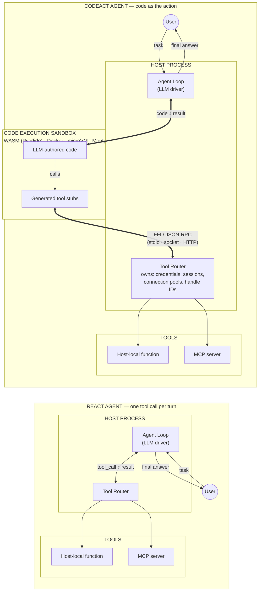
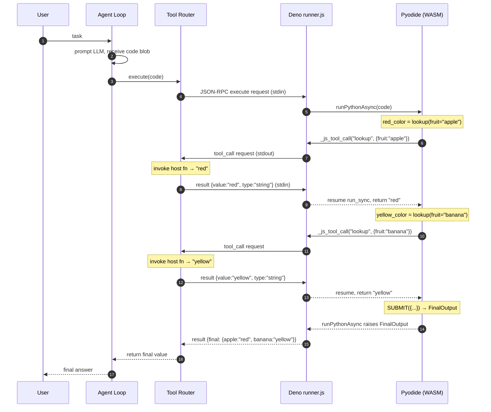

# CodeAct Agent Architecture

This document sketches the general architecture of a **CodeAct**-style autonomous agent — one whose action space is *programs* rather than discrete tool calls — and how such an agent integrates tools through a code execution sandbox.

The sandbox is where **LLM-authored logic** runs. It is *not* where every tool's runtime lives. Tools live wherever they naturally belong; the sandbox reaches them via an FFI-style bridge routed by the host.

## General Architecture

The contrast that matters: **ReAct** has the LLM emit one tool call at a time and round-trips through the model between every action. **CodeAct** has the LLM emit a program; many tool calls execute *inside* one code execution before the model is asked again.



The two agents differ in **where actions originate** and **how often the LLM is invoked**:

| | ReAct | CodeAct |
|---|---|---|
| Unit of action | One tool call | One code blob |
| LLM invocations per N tool calls | **N** (round-trip per call) | **1** (all calls inside one execution) |
| Sandbox required | No | Yes |
| Loop ↔ Router | Yes — Loop emits each tool call | No — Router handles tool calls coming from sandbox |
| Where credentials live | Router (host) | Router (host) — same |
| Composability across calls (loops, conditionals) | LLM has to plan + emit each step | Native Python in the sandbox |

Browsers, databases, sub-LLM calls, cloud APIs, etc. are all just **specific kinds of tool** in both architectures — either a host-local function that wraps the underlying client, or an MCP server that exposes it. From the agent's perspective, they're all named callables behind the Router.

### CodeAct component roles

| Component | Responsibility | Examples |
|---|---|---|
| **Agent Loop** | Run the LLM, decide when to execute code vs. return | DSPy `RLM`, smolagents `CodeAgent`, CodeAct runtime |
| **Tool Router** | Resolve a tool name to a concrete runtime; hold secrets and handle IDs | Per-framework; often a dict of callables + adapters |
| **Sandbox** | Execute LLM-authored code under isolation; expose tool stubs | WASM (Pyodide+Deno), Docker container, Firecracker microVM, Monty |
| **Tool stubs** | Language-native wrapper functions inside the sandbox that RPC back to the host | Dynamically generated from tool signatures |
| **Tools** | Do the real work; live wherever makes physical sense | Host-local function, MCP server |

### Key invariants

1. **The LLM emits one code blob per turn**, not per action. The code may invoke many tools.
2. **No tool runtime is inside the sandbox by default.** The sandbox holds only the LLM-authored logic and stubs.
3. **The router owns secrets and stateful handles.** Sandboxed code references them by opaque ID (session_id, page_id, artifact_id), never by live object.
4. **Transport is uniform.** Whether the tool is a host-local function or an MCP server, the sandbox calls it as `tool_name(kwargs)` and the router fans out.
5. **The sandbox is replaceable.** Swap WASM for Docker for Monty without changing the tool contract.

## Call Sequence: WASM Sandbox Example

This walks through a single agent turn with the sandbox being WASM/Pyodide hosted in Deno (DSPy's current stack). One host-local tool is registered: `lookup(fruit) -> color`.

### Code the LLM emits for this turn

```python
red_color = lookup(fruit="apple")
yellow_color = lookup(fruit="banana")
SUBMIT({"apple": red_color, "banana": yellow_color})
```

Two tool calls, then a `SUBMIT`. Both calls happen **inside one `execute`** — no LLM round-trip between them.

### Sequence



### Walkthrough

1. **User → Agent Loop.** User submits a task. The loop prompts the LLM and gets back the code blob above.
2. **Agent Loop → Router.** The loop calls `execute(code)` on the Router and **blocks** until it returns. The loop sees no intermediate traffic.
3. **Router → Sandbox.** Router writes a JSON-RPC `execute` request onto Deno's stdin. Deno's `runner.js` hands the code to Pyodide via `runPythonAsync`.
4. **First tool call.** `lookup(fruit="apple")` — the stub (generated at tool-registration time) invokes a JS function `_js_tool_call` bridged into Python globals. The JS side emits a `tool_call` JSON-RPC request on Deno's stdout.
5. **Router dispatches.** Router reads the `tool_call` line off stdout, invokes the registered host-side `lookup` function, and writes the result back on stdin.
6. **Sandbox resumes.** The `run_sync` wrapper in Pyodide unblocks; the Python stub returns `"red"` to LLM-authored code.
7. **Second tool call.** Same pattern for `lookup(fruit="banana")`. All still inside the same `execute`.
8. **SUBMIT.** `SUBMIT({...})` raises the `FinalOutput` control-flow exception; `runner.js` catches it and emits a `result` with a `final` field.
9. **Router returns to Loop.** Router reads the final result, returns it from `execute()`. Loop hands it to the user (or prompts the LLM for the next turn).

### What each layer provides

| Layer | What it buys you |
|---|---|
| **WASM (Pyodide)** | Structural isolation (no syscalls), fast-ish startup (~100s of ms), in-process WASM engine, no network/fs by default |
| **Deno** | OS-level permission model (`--allow-read/net/env`), WASM host, JS ↔ Python FFI runtime |
| **JSON-RPC over stdio** | Simple, debuggable, bidirectional, industry-standard (LSP/MCP/DAP) |
| **Tool Router** | Credential isolation, handle management, uniform stub interface across tool kinds |
| **Separate tool services** | Physical fit (browsers want a real OS, DBs want real connections), independent scaling, isolation per tool |

## Why this shape generalizes

The same diagram applies if you swap the sandbox implementation:

- **Docker sandbox** — replace Deno+Pyodide with `docker run -i` subprocess; keep the JSON-RPC shape. Full CPython + third-party libs; higher cold-start cost.
- **Firecracker / microVM** (E2B-style) — replace stdio with HTTPS/WebSocket; keep the stub-RPC pattern. Network isolation; remote execution.
- **Monty (in-process Rust)** — collapse the bridge to PyO3 suspend/resume; no subprocess at all. Sub-millisecond startup; limited Python subset.

The tool-routing layer doesn't change. Tools keep running in their own runtimes. Only the bridge between sandbox and host moves.

## Practical notes

- **Large payloads** (screenshots, PDFs, files): pass opaque IDs through JSON-RPC; stream bytes through a side channel (shared mount, artifact store, file FS).
- **Concurrency** (`asyncio.gather` in sandbox code): JSON-RPC over a single stdio pair is serial; for real parallelism either use multiple channels, HTTP, or accept serial dispatch.
- **Long-lived sessions**: keep the sandbox process alive across `execute` calls so browser handles and DB cursors persist (DSPy's Pyodide interpreter already does this).
- **Credential locality**: never inject secrets into the sandbox; expose a `get_secret(name)` router call or bake auth into the tool itself.
- **Tool discovery**: register tool signatures at sandbox start; let the LLM see them via introspection (`help(browser)`) the same way a Python REPL does.
